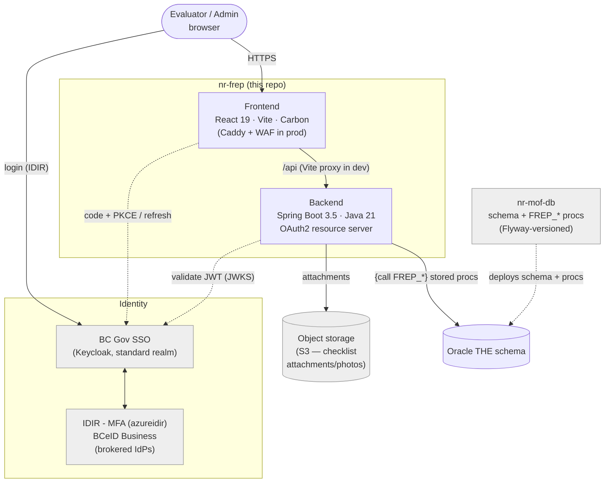

# Architecture

FREP (Forest and Range Evaluation Program) is a full-stack application for the BC Natural Resources
sector. Field evaluators record protocol **checklists** against forestry **sites** selected for a
master-list year; the app supports site selection, checklist capture/edit, search, and reporting.

## Tech stack

| Layer | Technology |
|---|---|
| Frontend | React 19 + TypeScript, Vite 7, Carbon Design System (`@carbon/react`) |
| Routing / data | `react-router-dom` 7, TanStack Query 5 (server state; no global store — auth/page-title via React Context) |
| Offline / maps | Dexie (IndexedDB) + `vite-plugin-pwa` for offline CHR; Leaflet for maps |
| Backend | Spring Boot 3.5, Java 21, Undertow (Tomcat excluded), Maven |
| Persistence | Spring Data JPA + Oracle `ojdbc11`; JasperReports + Commons CSV for reports; AWS S3 SDK for attachments |
| Auth | BC Gov SSO (Keycloak, standard realm), IDIR sign-in |
| Database | External, shared Oracle `THE` schema |

Runtimes: backend targets **Java 21**; the frontend production image and CI pin **Node 24** (the local Compose dev image uses Node 22; the README minimum is Node 20).

## System context

FREP spans **two repositories over one Oracle `THE` schema**:

- **`nr-frep`** (this repo) — the React + Spring Boot app.
- **`nr-mof-db`** — the Oracle schema + `FREP_*` stored procedures, versioned with Flyway.

The app never issues direct table writes — all reads and writes go through the `FREP_*` stored
procedures. See [database.md](./database.md) and [deployment.md](./deployment.md).

## Frontend domains

Routes are declared in `src/routes/routePaths.tsx` and selected by auth state in
`src/routes/AppRoutes.tsx`. Pages live in `src/pages/`.

| Domain | Route | What it does |
|---|---|---|
| Dashboard | `/dashboard` | Post-login home; offline mode shows only the offline checklist path |
| Random List | `/random-list` | District random-list generation / selection for a master-list year |
| Accepted Sites | `/accepted-sites` | Accepted/targeted sites by org unit + year |
| Add Target Site | `/add-target-site`, `/site-detail/new` | Opening search → create a targeted site |
| Site Detail | `/site-detail/:id` | View/edit a single site's resources |
| Biodiversity checklist | `/protocol-checklists/slr/:id` | Biodiversity (SLB/SLR) checklist editor |
| CHR checklist | `/protocol-checklists/chr/:id`, `/chr/offline` | CHR editor + offline (IndexedDB) list |
| Checklist Search | `/search/checklists` | Cross-protocol checklist search |
| Reports | `/reports` | Jasper/CSV report generation |
| Admin | `/admin/master-list` | Generate the master list (role-gated `FREP_ADMINISTRATOR`) |

The sidebar is derived from routes flagged as menu entries and filtered by role. An offline route set
exposes only Dashboard + CHR.

## Backend structure

Package root `ca.bc.gov.nrs.frep`, layered:

- `endpoint/v1` — REST endpoints (`@RequestMapping`, `@PreAuthorize`, Swagger tags).
- `controller/v1` — request/response orchestration (one per endpoint).
- `service/v1` (+ `chr`, `frep`, `report`) — business logic.
- `repository/v1` (+ `impl`) — Oracle stored-proc access.
- `struct/v1` — Oracle object/VARRAY (STRUCT) mappings.
- plus `configuration`, `security`, `entity`, `mapper`, `exception`, `util`, `validation`.

All controllers sit under `/api/v1`: Accepted Sites, Configuration (code lists), CHR, Master List
Admin, OpenMaps, Random List, Protocol (biodiversity) Checklist, Opening Target, Reports, Site Detail,
Search.

**Repository → stored-proc pattern:** every repository extends `AbstractFrepRepository`, which runs
`{call FREP_*}` via a `CallableStatement` with positional params, reads REF CURSORs / VARRAYs, and
surfaces PL/SQL `p_error_message` as a `StoredProcedureException`. There are no direct table writes.
See [database.md](./database.md).

## Protocol types

Checklists come in four protocol families; only two are editable in the new app:

| Family | Code(s) | Status in new app |
|---|---|---|
| Biodiversity | `SLB` (legacy) / `SLR` (go-forward) | **Active** — editable. The route is the *family* (`/…/slr/:id`); the record's actual SLB/SLR code comes from the GET, not the URL. |
| CHR (Culture Heritage) | `CHR` | **Active** — editable, and offline-capable (IndexedDB). |
| Riparian | `RIP` | **Legacy-only** — out of scope for editing; still readable via shared read/search. |
| Water | `WTR` | **Legacy-only** — same as riparian. |

> Naming caveat: the shared checklist tabs (Administration / Notes / Attachments) are named `Rip*`
> (`RipAdministrationView`, etc.) for legacy reasons but are used by **Biodiversity**, not Riparian.

For the biodiversity SLB→SLR rename and the view-only strategy for historical SLB records, see the
project's migration notes.

## Authentication & authorization

**Identity:** BC Gov SSO — Keycloak's **standard realm**, integrated through CSS — brokering
**IDIR - MFA** (published by the realm as `azureidir`) and **BCeID Business**. The whole client configuration is one issuer URI plus a client
id; `oidc-client-ts` reads the realm's `.well-known/openid-configuration` and discovers the
authorize, token, JWKS and end-session endpoints from it.

**Frontend** (`src/services/keycloak.ts`, `src/context/auth/AuthProvider.tsx`): Authorization Code +
PKCE, public client, tokens in `sessionStorage`. `login()` starts the redirect with
`kc_idp_hint=azureidir` (IDIR) or `bceidbusiness`; `/authCallback` (`src/pages/AuthCallback`)
completes the code exchange and is the route that creates the session. Redirect URIs are derived from
`window.location.origin`, so one built image serves every environment. `src/hooks/useAuthorization`
derives role helpers from the roles on the access token. Routing gates on auth state: no session →
public/offline set; session but no FREP role → `/unauthorized`; session with a role → the protected
app.

**Backend** (`configuration/SecurityConfiguration`, `security/*`): an OAuth2 **resource server**
validates access tokens (Nimbus JWT decoder with cached JWKS at
`<issuer>/protocol/openid-connect/certs`), and enforces CSRF via a cookie-token strategy. URL rules
are coarse (`/actuator/**` and `OPTIONS` public, everything else authenticated); fine-grained checks
are per-endpoint `@PreAuthorize`.

**Roles** (CSS roles → legacy WebADE semantics):

| Role | Meaning | Grants |
|---|---|---|
| `FREP_ADMINISTRATOR` | Sys-admin | All, incl. `/api/v1/admin/**` and master-list generation |
| `FREP_EDITOR` | Update | Create/edit/delete checklists & sites |
| `FREP_CHR_EDITOR_DISTRICT_<code>` | District CHR editor | CHR checklists for that district only |

Write endpoints require `CONTENT_EDIT` (`FREP_ADMINISTRATOR` or `FREP_EDITOR`); admin endpoints require
`ADMIN` (`FREP_ADMINISTRATOR`). The legacy read-only role `FREP_VIEW_ONLY` has been retired.

### Three things about this integration that fail silently

Each of these produces a working-looking application, so they are worth knowing before debugging
anything else:

1. **No `token_use` claim.** Cognito emitted one and the resource server required it to be
   `"access"`. Keycloak emits nothing of the kind, so that validator would 401 every request —
   health probes included, which reads as a failed deploy rather than failed auth. It is replaced by
   an **`azp` check** against the configured client id: the standard realm is shared across BC Gov
   applications, and every one of their tokens verifies against the same JWKS, so signature + issuer
   alone do not establish that a token was meant for FREP.
2. **The realm reports IDIR as `azureidir`.** FREP's integration selects IDIR - MFA, which
   federates via Azure AD. Mapping the value verbatim writes `AZUREIDIR\jsmith` into `create_user` /
   `update_user` for the same person whose older rows say `IDIR\jsmith` — no error, no failing test,
   an audit trail that stops joining up at the cutover date. Both `JwtPrincipalUtil` (backend) and
   `authUtils` (frontend) normalise every IDIR alias to the single string `IDIR`. Relatedly, an
   unrecognised `kc_idp_hint` is **silently ignored** — Keycloak falls through to whatever provider
   the client has, so a wrong alias still looks like it works. Verify against the realm (a 303 to
   `/broker/azureidir/login`) rather than concluding from a successful login.
3. **Roles arrive in one of two places.** CSS emits a flat `client_roles` array; stock Keycloak nests
   them under `resource_access.<client>.roles`. Which one is populated depends on the realm's
   mappers, and reading only the other yields a user with no roles — indistinguishable from revoked
   access. Both are read, on both sides. FAM's per-grant expiry bookkeeping (`FAM:EXPIRES:…`) is
   filtered out, also on both sides.

Profile claims (`idir_username`, `idir_user_guid`, `identity_provider`, `display_name`) ride the
**access token**, so there is no per-request userinfo call. If `idir_username` is absent, the
integration's mappers were added to the ID token only — a CSS console setting, not a code change.

## Related

- [Deployment](./deployment.md)
- [Database](./database.md)
- [Testing](./testing.md)
