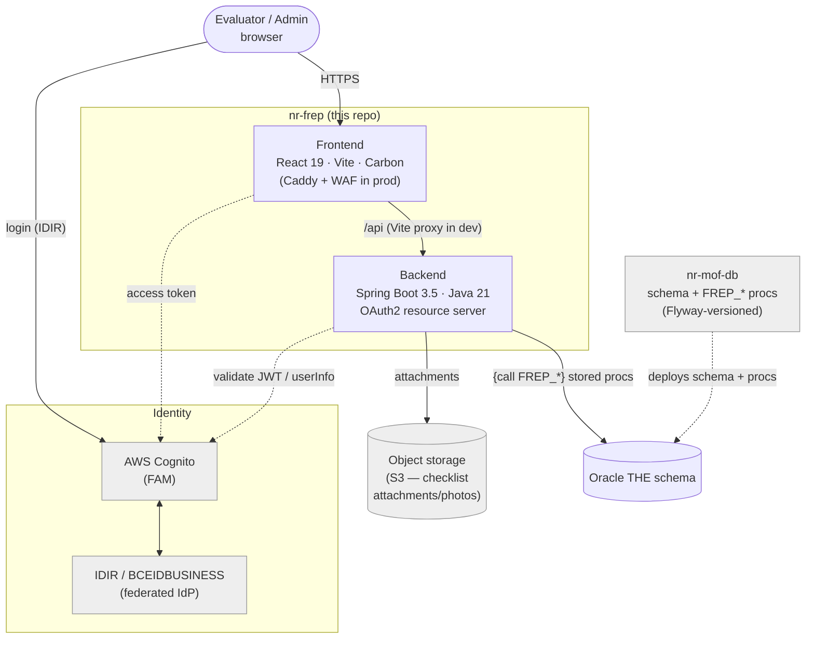

# Architecture

FREP (Forest and Range Evaluation Program) is a full-stack application for the BC Natural Resources
sector. Field evaluators record protocol **checklists** against forestry **sites** selected for a
master-list year; the app supports site selection, checklist capture/edit, search, and reporting.

## Tech stack

| Layer | Technology |
|---|---|
| Frontend | React 19 + TypeScript, Vite 7, Carbon Design System (`@carbon/react`) |
| Routing / data | `react-router-dom` 7, TanStack Query 5 (server state; no global store — auth/page-title via React Context) |
| Offline / maps | Dexie (IndexedDB) + `vite-plugin-pwa` for offline CHR; Leaflet for maps |
| Backend | Spring Boot 3.5, Java 21, Undertow (Tomcat excluded), Maven |
| Persistence | Spring Data JPA + Oracle `ojdbc11`; JasperReports + Commons CSV for reports; AWS S3 SDK for attachments |
| Auth | AWS Cognito (FAM), IDIR sign-in |
| Database | External, shared Oracle `THE` schema |

Runtimes: backend targets **Java 21**; the frontend production image and CI pin **Node 24** (the local Compose dev image uses Node 22; the README minimum is Node 20).

## System context

FREP spans **two repositories over one Oracle `THE` schema**:

- **`nr-frep`** (this repo) — the React + Spring Boot app.
- **`nr-mof-db`** — the Oracle schema + `FREP_*` stored procedures, versioned with Flyway.

The app never issues direct table writes — all reads and writes go through the `FREP_*` stored
procedures. See [database.md](./database.md) and [deployment.md](./deployment.md).

## Frontend domains

Routes are declared in `src/routes/routePaths.tsx` and selected by auth state in
`src/routes/AppRoutes.tsx`. Pages live in `src/pages/`.

| Domain | Route | What it does |
|---|---|---|
| Dashboard | `/dashboard` | Post-login home; offline mode shows only the offline checklist path |
| Random List | `/random-list` | District random-list generation / selection for a master-list year |
| Accepted Sites | `/accepted-sites` | Accepted/targeted sites by org unit + year |
| Add Target Site | `/add-target-site`, `/site-detail/new` | Opening search → create a targeted site |
| Site Detail | `/site-detail/:id` | View/edit a single site's resources |
| Biodiversity checklist | `/protocol-checklists/slr/:id` | Biodiversity (SLB/SLR) checklist editor |
| CHR checklist | `/protocol-checklists/chr/:id`, `/chr/offline` | CHR editor + offline (IndexedDB) list |
| Checklist Search | `/search/checklists` | Cross-protocol checklist search |
| Reports | `/reports` | Jasper/CSV report generation |
| Admin | `/admin/master-list` | Generate the master list (role-gated `FREP_ADMIN`) |

The sidebar is derived from routes flagged as menu entries and filtered by role. An offline route set
exposes only Dashboard + CHR.

## Backend structure

Package root `ca.bc.gov.nrs.frep`, layered:

- `endpoint/v1` — REST endpoints (`@RequestMapping`, `@PreAuthorize`, Swagger tags).
- `controller/v1` — request/response orchestration (one per endpoint).
- `service/v1` (+ `chr`, `frep`, `report`) — business logic.
- `repository/v1` (+ `impl`) — Oracle stored-proc access.
- `struct/v1` — Oracle object/VARRAY (STRUCT) mappings.
- plus `configuration`, `security`, `entity`, `mapper`, `exception`, `util`, `validation`.

All controllers sit under `/api/v1`: Accepted Sites, Configuration (code lists), CHR, Master List
Admin, OpenMaps, Random List, Protocol (biodiversity) Checklist, Opening Target, Reports, Site Detail,
Search.

**Repository → stored-proc pattern:** every repository extends `AbstractFrepRepository`, which runs
`{call FREP_*}` via a `CallableStatement` with positional params, reads REF CURSORs / VARRAYs, and
surfaces PL/SQL `p_error_message` as a `StoredProcedureException`. There are no direct table writes.
See [database.md](./database.md).

## Protocol types

Checklists come in four protocol families; only two are editable in the new app:

| Family | Code(s) | Status in new app |
|---|---|---|
| Biodiversity | `SLB` (legacy) / `SLR` (go-forward) | **Active** — editable. The route is the *family* (`/…/slr/:id`); the record's actual SLB/SLR code comes from the GET, not the URL. |
| CHR (Culture Heritage) | `CHR` | **Active** — editable, and offline-capable (IndexedDB). |
| Riparian | `RIP` | **Legacy-only** — out of scope for editing; still readable via shared read/search. |
| Water | `WTR` | **Legacy-only** — same as riparian. |

> Naming caveat: the shared checklist tabs (Administration / Notes / Attachments) are named `Rip*`
> (`RipAdministrationView`, etc.) for legacy reasons but are used by **Biodiversity**, not Riparian.

For the biodiversity SLB→SLR rename and the view-only strategy for historical SLB records, see the
project's migration notes.

## Authentication & authorization

**Identity:** AWS Cognito fronting BC Gov **FAM**, which federates to **IDIR** (and BCEIDBUSINESS)
as the upstream IdP. The app talks to Cognito; Cognito federates to `<ENV>-IDIR`.

**Frontend** (`src/context/auth/AuthProvider.tsx`): AWS Amplify drives the Cognito flow —
`login()` calls `signInWithRedirect` with the env-prefixed IDIR provider; the session is hydrated
from the Amplify token on mount, refreshed proactively near expiry, and read synchronously by the
axios interceptors. `src/hooks/useAuthorization` derives role helpers (`canEdit`, `canCreate`,
`isViewOnly`, …) from Cognito groups. Routing gates on auth state: no session → public/offline set;
session but no FREP role → `/unauthorized`; session with a role → the protected app.

**Backend** (`configuration/SecurityConfiguration`, `security/*`): an OAuth2 **resource server**
validates Cognito **access** tokens (Nimbus JWT decoder with cached JWKS; rejects non-access tokens),
maps the `cognito:groups` claim to authorities (no `ROLE_` prefix), and enforces CSRF via a
cookie-token strategy. URL rules are coarse (`/actuator/**` and `OPTIONS` public, everything else
authenticated); fine-grained checks are per-endpoint `@PreAuthorize`.

**Roles** (Cognito groups → legacy WebADE semantics):

| Group | Meaning | Grants |
|---|---|---|
| `FREP_ADMIN` | Sys-admin | All, incl. `/api/v1/admin/**` and master-list generation |
| `FREP_EDITOR` | Update | Create/edit/delete checklists & sites |
| `FREP_VIEW_ONLY` | Read | `GET` only |

Write endpoints require `CONTENT_EDIT` (`FREP_ADMIN` or `FREP_EDITOR`); admin endpoints require
`ADMIN` (`FREP_ADMIN`). Because the app sends the access token (not the ID token), profile claims are
fetched from Cognito `/oauth2/userInfo` and cached briefly.

## Related

- [Deployment](./deployment.md)
- [Database](./database.md)
- [Testing](./testing.md)
