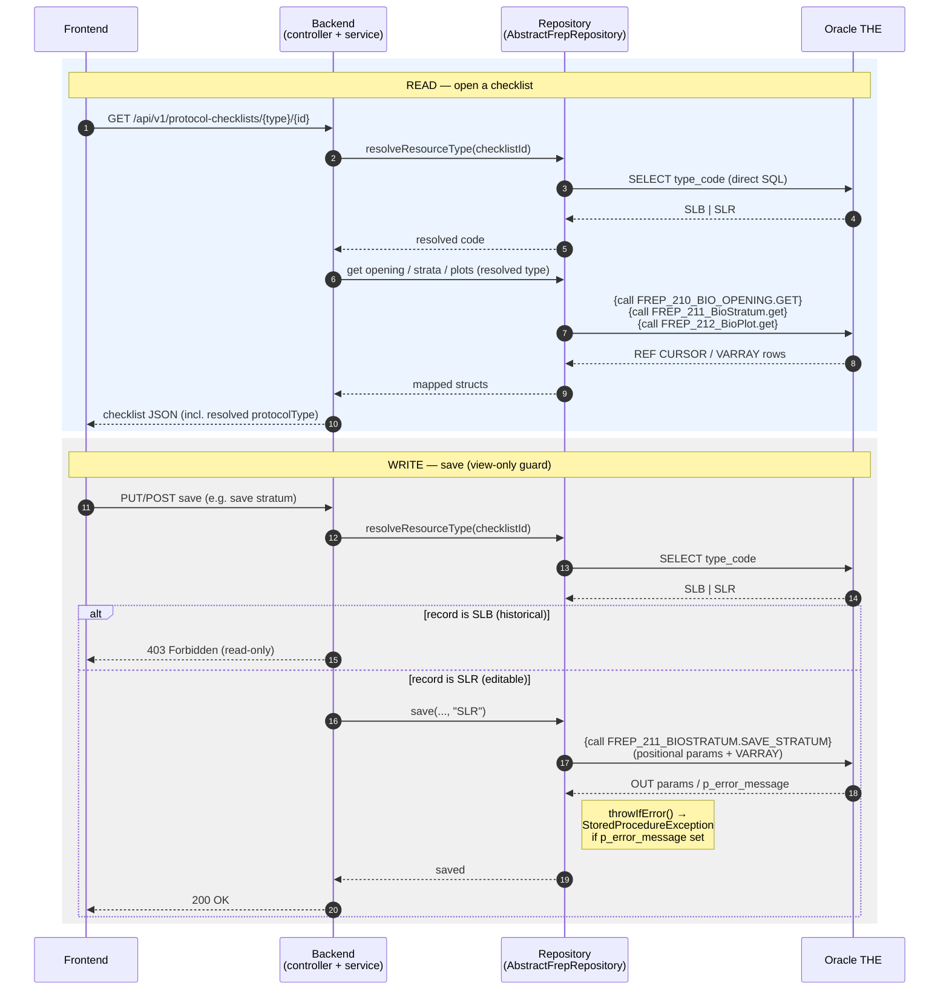

# Database

FREP reads and writes an **externally-managed, shared Oracle `THE` schema** through legacy stored
procedures. There is **no local Oracle, no Flyway, and no DDL in this repo** — all schema objects,
stored procedures, and reference data live in the separate **`nr-mof-db`** repository.

## Connectivity

Oracle is configured via standard `spring.datasource.*` properties. The JDBC URL is composed from
`DATABASE_HOST` + `DATABASE_SERVICE_NAME` (TCPS on port `1543`; truststore defaults to
`/cert/jssecacerts` in-cluster).

| Variable | Description |
|---|---|
| `DATABASE_HOST` | Oracle listener host |
| `DATABASE_PORT` | Listener port (default `1543`, TCPS) |
| `DATABASE_SERVICE_NAME` | Oracle service name |
| `DATABASE_USER` / `DATABASE_PASSWORD` | FREP schema credentials |
| `TRUSTSTORE_PATH` | Path to the TCPS truststore (cluster default `/cert/jssecacerts`) |
| `KEYSTORE_SECRET` | Truststore password |

Sanity check once connected:
```bash
curl -H "Authorization: Bearer $TOKEN" http://localhost:8080/api/v1/configuration/org-units
```

## Access pattern: stored procedures, not direct SQL

- The backend does **not** issue direct table writes. Every write goes through an Oracle package
  (`THE.FREP_*`), invoked as `{call PACKAGE.PROC(...)}` from a repository that extends
  `AbstractFrepRepository`.
- The only raw SQL in the backend is **read-only SELECTs** (e.g. the checklist-search query and a
  couple of id↔code lookups).
- Many procs exchange data via Oracle object/VARRAY types (e.g. `FREP_RESOURCE_VARRAY`,
  `FREP_CHKLST_SEARCH_VW_VARRAY`) rather than plain scalars.

## Checklist read / write sequence

A biodiversity checklist illustrates the pattern. The record's protocol code (`SLB` vs `SLR`) is
resolved **from the record** — a small direct SELECT — not from the URL, and the write path enforces
a **view-only guard** so historical `SLB` records can't be mutated.



New biodiversity records are always created as `SLR` (the service rewrites any id-less `SLB` on
persist), and the same `assertEditable` guard is wired into **every** mutation (submit, unsubmit,
save/delete stratum & plot, admin, team, notes, attachments).

## Stored procedures by feature

| Feature | Procedure(s) |
|---|---|
| Code lists (districts, master-list years, protocols) | `FREP_CODE_LISTS.GET_DISTRICT_ORG_UNIT_CODE`, `.GET_MASTERLIST_YEAR_CODE`, `.GET_RESOURCE_VALUE` |
| Accepted sites | `FREP_200_ACCEPTED_SITES.GET` |
| District random list | `FREP_100_DIST_RAND_LIST.GET` |
| Checklist / client search | `FREP_400_CHECKLIST_SEARCH`, `FREP_410_CLIENT_SEARCH` |
| Site details | `FREP_110_SITE_DETAILS.GET` / `.SAVE` |
| Master-list admin & generation | `FREP_700_GEN_MASTER.GET` / `.GENERATE` |
| Biodiversity checklist | `FREP_210_BIO_OPENING.GET`, `FREP_211_BIOSTRATUM`, `FREP_212_BIOPLOT` |
| Riparian checklist | `FREP_230_STRM_OPEN`, `FREP_231_FIELD_DATA`, `FREP_232_OTHER_INDS`, `FREP_233_QUESTIONS`, `FREP_234_SPECIFIC_IMPACTS`, `FREP_235_FINAL_CMTS` |
| Water checklist | `FREP_250_WATER_CHKLST`, `FREP_251_SAMPLE_SITE`, `FREP_252_ASSESSMENT`, `FREP_253_RANGE`, `FREP_254_SUMMARY` |
| Checklist lifecycle (submit/unsubmit/tombstone) | `FREP_TOMBSTONE.*` |

> CHR (Culture Heritage) checklists differ: they use JPA persistence adapted from the legacy
> `RestDataManager` plus JDBC tombstone calls, and store photos in S3-compatible object storage
> (`frep.chr.object-storage.*`).

## Key tables (reference)

- `THE.FREP_SELECTED_SITE` — sites per master-list year (`effective_year`, a NUMBER: `2026` = fiscal
  2026/2027). Randomly-selected (random-list) rows carry `frep_selected_site_code = 'R'`.
- `THE.FREP_RESOURCE_VALUE` — links a site to a protocol instance; `frep_resource_value_type_code`
  holds the protocol code.
- `THE.FREP_RESOURCE_VALUE_TYPE_CODE` — protocol code list + descriptions (`SLB`/`SLR`, `CHR`,
  riparian, water).
- Per-protocol checklist tables: `THE.biodiversity_checklist`, `THE.chr_checklist`,
  `THE.riparian_checklist`, `THE.water_checklist` (each links back via `frep_resource_value_id`).

## Migrations (`nr-mof-db`)

- Schema/reference-data changes are **Flyway-versioned SQL** in `nr-mof-db`: versioned migrations
  (`V<timestamp>__NAME.sql`) for one-time DML/DDL, and repeatable files (`R__…`) for stored-proc
  bodies that redeploy on checksum change.
- **A DB change must deploy before app code that depends on it.** A common pattern is to keep the app
  PR in **draft** until the `nr-mof-db` PR merges and deploys — see [deployment.md](./deployment.md).

## Grants & synonyms

- Procs run with **definer rights**; converting a proc call to native SQL in the app requires
  THE-qualification (or the PUBLIC synonym) **and** per-table `SELECT` grants the proc didn't need.
  A missing/ungranted table surfaces as `ORA-00942`.

## Related

- [Deployment](./deployment.md)
- [Architecture](./architecture.md)
