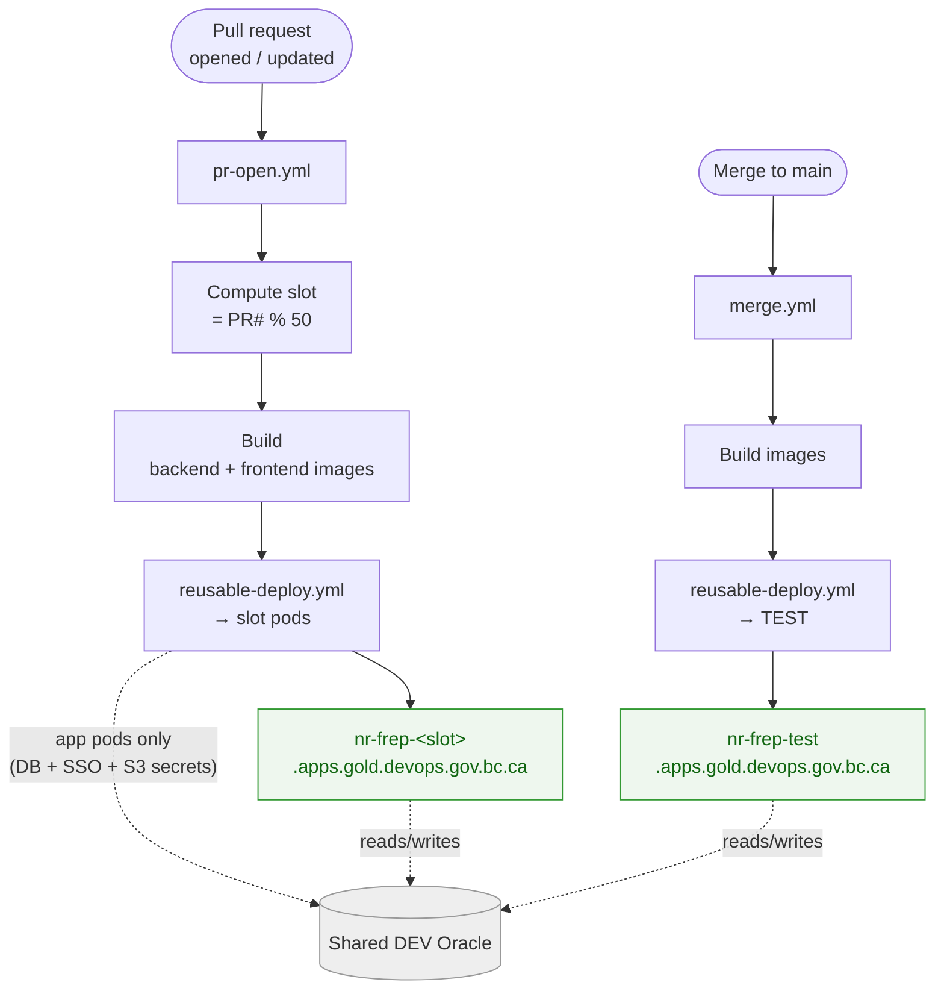

# Deployment

FREP deploys to **OpenShift** (BC Gov Gold cluster) via GitHub Actions. The **app** is deployed
per-PR into numbered slots; the **database is a single shared external Oracle**, not per-PR.

## Environments

- Cluster domain: `apps.gold.devops.gov.bc.ca`
- Per-PR app URL: `https://nr-frep-<slot>.apps.gold.devops.gov.bc.ca`
- **TEST**: `https://nr-frep-test.apps.gold.devops.gov.bc.ca` (deployed on merge to `main`)
  - **PROD**: `https://frep.nrs.gov.bc.ca` —
    **currently not auto-deployed.** PROD deploy + image promotion are **temporarily disabled** in
    `merge.yml` (the `deploy-prod` and `promote` jobs are commented out), so merges to `main` deploy only
    to TEST. Re-enabling them restores the flow: deploy the merged PR's image tag to PROD, then alias
    that image as `:prod` in GHCR (a durable "this is what's running in production" record).

## Per-PR slots

- Each PR deploys to an app slot computed as **`slot = PR# % 50`**. The cap of 50 exists because 50
  redirect URIs are pre-registered for the IDIR round trip. This is inherited from Cognito, whose app
  clients reject wildcards in CallbackURLs; whether a CSS integration would accept a wildcard —
  letting the whole slot scheme go — is an open question for the CSS team.
- Only the **application pods** (backend + frontend) are per-PR. The per-PR **database was
  deliberately dropped** — all slots point at the **same shared DEV Oracle**.
- **Implication:** any data created on any slot (via the UI/API or a test) lands in the shared DEV
  Oracle, is visible to every other slot, and **persists** (no teardown). Tests are written to be
  data-agnostic for this reason — see [testing.md](./testing.md).

## CI/CD workflows

Located in `.github/workflows/`:

- **`pr-open.yml`** (on `pull_request`) → build → `reusable-deploy.yml` (deploy to the PR slot).
- **`merge.yml`** (on merge to `main`) → deploy to **TEST**.
- **`reusable-deploy.yml`** — the shared deploy job; injects Oracle + BC Gov SSO + object-storage
  values into the pods. The realm issuer and client id are each stored **once** as a GitHub variable
  and fed to both deploy templates — the container env var names differ (`VITE_` is load-bearing) but
  the CI variables must not, or the pair drifts and every request 401s after a successful sign-in. (Note: DB credentials go to the **app pod only**, never to the test job.)
- **`reusable-tests.yml`** — the shared Playwright E2E job. **Currently not invoked** (2026-09-09):
  both call sites are commented out because FREP's CSS integration brokers IDIR - MFA, and a second
  factor is something the `E2E_IDIR_USER` / `E2E_IDIR_PASSWORD` credentials cannot supply, so
  `auth.setup.ts` cannot get a session unattended. Re-enabling needs an MFA-exempt service account
  or a strategy that avoids the browser login. The workflow and the suite are both kept current —
  see [testing.md](./testing.md).
- **Unit and browser-mode tests are unaffected.** `analysis.yml` runs `npm run test:coverage`
  (Vitest) plus lint and SonarCloud on every PR and merge.

### Deploy flow

Both the per-PR slots **and** TEST point at the **same shared DEV Oracle** — only the app pods are
isolated per slot, not the data. The E2E job never receives DB credentials; it drives the deployed app
over HTTP with only IDIR test-user secrets.

## Cross-repo release coordination

FREP spans two repos over one Oracle database:

- **`nr-frep`** (this repo) — the app.
- **`nr-mof-db`** — Oracle schema + stored procedures (Flyway). All DB changes ship here.

Rules of thumb:
- **DB before app.** A `nr-mof-db` migration must deploy before app code that depends on it. Keep the
  dependent app PR in **draft** until the DB PR merges/deploys. See [database.md](./database.md).

## Runtime notes

- The production frontend image is **Caddy + Coraza WAF**, with runtime config seeded by an
  entrypoint script (replicated locally via the `caddy` Compose profile — see
  [local-development.md](./local-development.md)).
- `/actuator/**` is public for OpenShift health probes and Prometheus scraping.

## Related

- [Database](./database.md)
- [Testing](./testing.md)
- [Architecture](./architecture.md)
