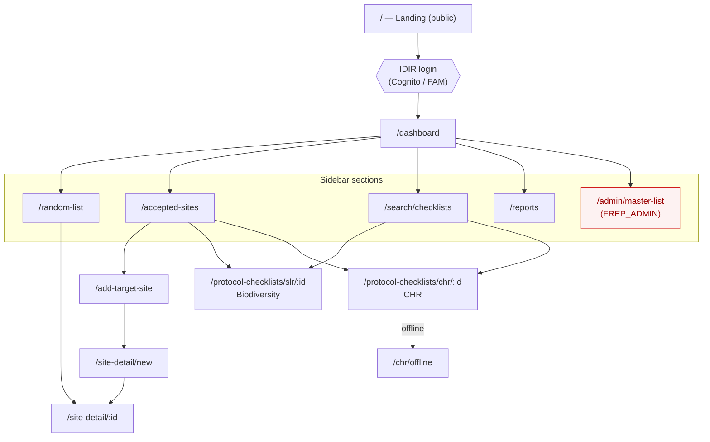

# Site map

The app's pages, how they're reached, and how a user navigates between them. The source of truth is
`frontend/src/routes/routePaths.tsx` (route table) and `frontend/src/routes/AppRoutes.tsx` (which
route set is active for a given auth state).

## Route sets by auth state

`AppRoutes` swaps the entire route set based on session + role:

| State | Available routes |
|---|---|
| **Not logged in** | `/` (Landing), `/auth/callback`, `*` (Not Found) — or the **offline set** when the device is offline |
| **Logged in, no FREP role** | `/unauthorized` only |
| **Logged in, has a FREP role** | The full **protected** app (below) |
| **Offline** | Dashboard + CHR routes only (`/dashboard`, `/protocol-checklists/chr/:id`, `/chr/offline`) |

## Routes

| Route | Page | In sidebar? | Role |
|---|---|---|---|
| `/` | Landing (public) | — | none |
| `/dashboard` | Dashboard | ✓ | any FREP role |
| `/random-list` | Random List | ✓ | any |
| `/accepted-sites` | Accepted Sites | ✓ | any |
| `/add-target-site` | Add Target Site (opening search) | — | any |
| `/site-detail/new` | Site Detail (create) | — | any |
| `/site-detail/:id` | Site Detail | — | any |
| `/protocol-checklists/slr/:id` | Biodiversity (SLB/SLR) checklist | — | any |
| `/protocol-checklists/chr/:id` | CHR checklist | — | any |
| `/chr/offline` | CHR offline list (IndexedDB) | — | any |
| `/search/checklists` | Checklist Search | ✓ | any |
| `/reports` | Reports | ✓ | any |
| `/admin/master-list` | Master List Admin | ✓ | **`FREP_ADMIN`** |
| `/unauthorized` | Role error | — | — |
| `*` | Not Found | — | — |

The sidebar is built from routes flagged as menu entries, then filtered by role — so only
`/admin/master-list` is hidden from non-admins. All other protected routes require *any* FREP role.

## Navigation flow

### How the drill-downs work

- **Dashboard** is the hub — its cards and the sidebar reach Random List, Accepted Sites, Checklist
  Search, Reports, and (admins only) Master List Admin.
- **Random List** links each row to its **Site Detail** (`/site-detail/:id`).
- **Accepted Sites** opens a site's **checklist** directly (biodiversity `slr` or `chr`), and offers
  **Add Target Site** to create a new one.
- **Add Target Site** (opening search) → **Site Detail (create)** (`/site-detail/new`), which on save
  redirects to the persisted **Site Detail** (`/site-detail/:id`).
- **Checklist Search** opens a result's **checklist** (biodiversity or CHR).
- **CHR** checklists have an **offline** list backed by IndexedDB, available in the offline route set.

> Note: biodiversity checklists route under the `slr` family segment regardless of the record's actual
> code — the real `SLB`/`SLR` code is resolved from the record on load. See
> [architecture.md](./architecture.md#protocol-types).

## Related

- [Architecture](./architecture.md)
